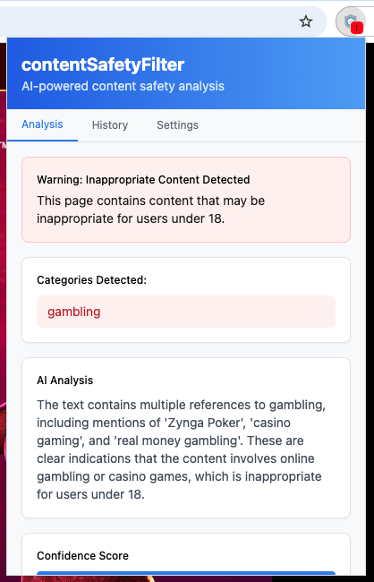
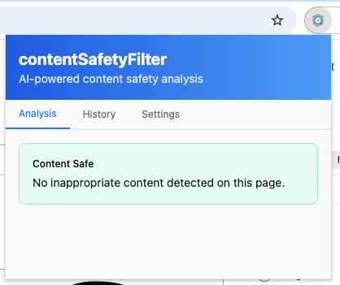
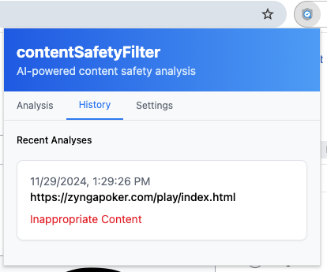
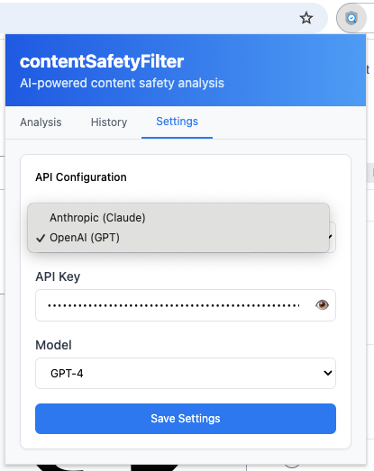

# contentSafetyFilter

An AI-powered Chrome extension that analyzes web content for age-appropriate material using Claude and GPT models.

## Features

### Real-time Content Analysis

- Detects inappropriate content categories (gambling, violence, sexual content, etc.)
- Provides detailed AI analysis explaining the findings
- Shows confidence score for detections
- Real-time alerts for potentially unsafe content

### Safe Content Verification

- Clear indication when content is safe
- Quick and efficient scanning
- Non-intrusive notifications

### History Tracking

- Maintains a log of all analyzed pages
- Timestamps for each analysis
- Quick access to previous results
- Clear inappropriate content markers

### Flexible Configuration

- Support for multiple AI providers:
  - Anthropic (Claude)
  - OpenAI (GPT)
- Configurable API keys
- Model selection options
- Secure local storage of settings

## Installation

1. Clone the repository:
```bash
git clone https://github.com/OrenGrinker/contentSafetyFilter.git
cd contentSafetyFilter
```

2. Install dependencies:
```bash
npm install
```

3. Configure your API keys:
- Open Settings tab in the extension
- Choose your preferred AI provider
- Enter your API key
- Select desired model

4. Build the extension:
```bash
npm run build
```

5. Load in Chrome:
- Open Chrome and go to `chrome://extensions/`
- Enable "Developer mode"
- Click "Load unpacked"
- Select the `dist` directory

## Development

### Prerequisites
- Node.js >= 18
- npm >= 8
- Chrome browser
- API key from Anthropic or OpenAI

### Available Commands
```bash
# Install dependencies
npm install

# Build once
npm run build

# Build and watch for changes
npm run watch

# Type checking
npm run type-check
```

### Project Structure
```
src/
├── components/    # UI components
├── services/     # AI service integrations
├── types/        # TypeScript definitions
├── popup/        # Extension popup UI
└── styles/       # Global styles
```

## Features
- Real-time content analysis
- Multiple AI provider support
- Detailed content categorization
- History tracking
- Secure API key management
- Safe/unsafe content indicators
- Confidence scoring

## Privacy & Security
- API keys stored locally
- No data collection or sharing
- All analysis performed through secure API calls
- Open source for transparency

## License
MIT

## Contributing
1. Fork the repository
2. Create your feature branch (`git checkout -b feature/amazing-feature`)
3. Commit your changes (`git commit -m 'Add amazing feature'`)
4. Push to the branch (`git push origin feature/amazing-feature`)
5. Open a Pull Request

## Acknowledgments
- [Anthropic](https://www.anthropic.com/) for Claude AI API
- [OpenAI](https://openai.com/) for GPT API
- [Chrome Extensions](https://developer.chrome.com/docs/extensions/) documentation

---
Made with ❤️ by [Oren Grinker](https://github.com/OrenGrinker)